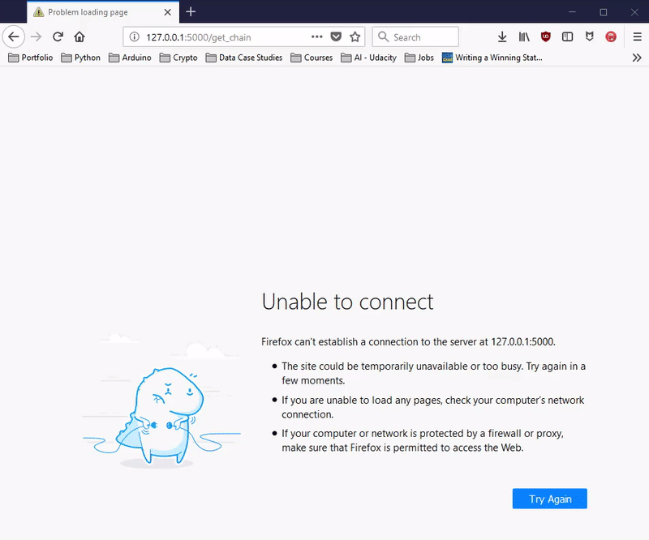

# Blockchain-AZ-Projects

## Table of Contents

1. [Summary](#Summary)
2. [Version Summary](#Version-Summary)
3. [Version 1.0 Creating the Basic Blockchain](#Version-1.0:-Creating-the-Basic-Blockchain)
4. [Notes](#Notes)
    1. [The blockchain](#THE-BLOCKCHAIN)
    2. [The Cryptocurrency](#THE-CRYPTOCURRENCY)
    3. [The Smart Contract](#THE-SMART-CONTRACT)
5. [Resources](Resources)

## Summary

## Version Summary
**V1.0**:
- Blockchain class created (without stored data)
- Able to rudimentarily: 
    - display the chain
    - mine a block
    - check the validity of the chain

## Version 1.0: Creating the Basic Blockchain
- Blockchain class created (without stored data)
- Able to rudimentarily: 
    - display the chain
    - mine a block
    - check the validity of the chain

### Instructions

**To run the code:**

1. Install Flask: `pip install Flask==0.12.2`
2. Run `python webapp.py`
3. Open browser and navigate to either of these web pages:
    1. `http://127.0.0.1:5000/get_chain`: displays the blockchain.
    2. `http://127.0.0.1:5000/mine_block`: mines a block
    3. `http://127.0.0.1:5000/get_chain`: checks the validity of the blockchain

## Notes

### THE BLOCKCHAIN

- **SHA256**
    - "finger print" of the current block
    - any change to the data will completely change the hash
    - a piece of data has a unique hash
    - 5 requirements
        - one way
        - deterministic
        - fast computation
        - avalanche effect
            - any change to the data will completely change the hash
        - must withstand collisions
            - collisions: different pieces of data that have the same hash
            - cannot purposefully create a different piece of data with the same hash
- **immutable ledger**
    - the impossibility to change the data in a blockchain without changing the entire blockchain
- **distributed P2P network**
    - everyone participating has a copy of the blockchain
    - the blockchain owned by the majority is the valid blockchain
- **mining: Nonce**
    - "Number used only once"
    - a way to manipulate the block hash by changing the Nonce (data, previous hash, and block number cannot be changed)
- **Consensus Protocol**
    - in case of two valid blocks mined at once, the one with the longest chain is chosen (more hashing power).
    - **Proof of Work (POW)**
        - A series of check to validate a block based on the work done to solve the cryptographic puzzle (hard to solve but easy to verify)
        - All you need to verify is to check that the block data does output the right hash
    - **Proof of Stake (POS)**
        - to be determined

### THE CRYPTOCURRENCY

- **What is Bitcoin?**
    - 3 layers:
        - technology
            - blockchain
        - protocol/coin: 
            - A set of rules that guides how participants in the networks to communicate with each other
            - Contains a coin
            - examples of protocols:
                - Bitcoin, Ethereum, etc...
        - token: ICOs offer tokens and not coins
            - rely on smart contract that rely on protocols
            - represents the "idea" behind what they are building
            - Bitcoin, and Ripple have no tokens
    - Invented by Satoshi Nakamoto
    - Bitcoin Ecosystem:
        - Nodes: People
        - Miners
        - Large mines
        - Mining Pools
- **Bitcoin's monetary policy**
    - Entirely controlled by the software
    - The halving
        - The number of Bitcoins released into the system (bitcoins per block) is halved every 210,000 blocks
        - 21 Million Bitcoins by 2140 (Since there is a finite number of decimals allowed)
        - If the number of Bitcoins users increase then the transaction fees should increase which should counter balance the loss of rewards from halving to the miners
    - inflation:
        - coinbase * BlocksPerYear / ExistingCoins
    - The Block Frequency
        - Average block time:
            - Bitcoin: 10min, Ethereum: 15s, etc...
- **Understanding mining difficulty**
    - Current target: leading zeros
        - If the Results space encompasses all possible hash (hexadecimal):
            - TotalResultsSpace*(1/16)^NumberLeadingZeros is the reduced results space
        - Bitcoin: As of 6/13/2018, the target is 18 leading zeros
            - Probability: 
                - Total possible hashes: 16^64
                - Total valid hashes: 16^46
                - Probability of randomly pick a valid hash: 2*10^-22
    - How is mining difficulty calculated:
        - Difficulty = current target / max target
        - Difficulty is adjusted every 2016 blocks (~2 weeks)
        - max target = 00000000FFFF0000000000000000000000000000000000000000000000000000
            - created at the very start of Bitcoin
        - adjusted so that it takes 10min to mine a bitcoin on average
            - However, power needed increases
        - currently 5 trillion times harder to mine a block than at the start:
            - [https://blockchain.info/charts/difficulty](https://blockchain.info/charts/difficulty)
- **Bitcoin mine**
    - Images of a large Bitcoin mine:
        - [Large Chinese Bitcoin Mine](https://qz.com/1055126/photos-china-has-one-of-worlds-largest-bitcoin-mines/)
- **Mining pools**
    - Personal computer mining is very unlikely to solve the cryptographic puzzle before large industrial mines
    - To solve that problem mining pools are created
        - several people combine their hashing power to compete
        - Distribution of the cryptographic puzzle to all participants to avoid double work
            - Not working on the same Nonce
        - Reward split depending on the hashing power contributed
    - Removes headache of programming and taking care of the mining
    - mining pool services take care of the computation entirely
- **Nonce range and how miners pick transactions**
    - Nonce: a field in the block that can be changed to allow miners to compute different hashes to solve the cryptographic puzzle
    - Nonce is not infinite: 32-bit number
        - 0 -> 4 bil
    - total possible 64 bit hexadecimal numbers: 10^64
    - total valid hashes: 16^46
    - probability that a random picked hash is valid: 2^-22
    - Total possible 32-bit Nonce numbers: 2^32
        - Assuming no collisions: 4*10^9 different hashes
    - Probability that ONE Nonce leads to a valid hash: 10^-12
        - MEANING: **One Nonce range is not enough to find a golden Nonce**
    - A modest miner does 100 Million hashes per second (MH/s)
        - a total Nonce range is then computed in 40seconds
        - A solution to this problem is the use of the **Unix Time** in the hashing.
            - since the time stamp is constantly changing every second, the hash also changes. Therefore, even if the Nonce range is limited, the hash is constantly changing with the changing time stamp allowing for the Nonce to be reset.
    - If the mining rate goes beyond 4 bil hashes per second (BH/s):
        - every node has a list of transactons stored in a **Mempool**
        - A miner will choose which transactions are stored in the block from the Mempool
            - Will choose the transactions with the highest fees.
        - If the miner is not able to solve the cryptographic puzzle he will change the transactions included (replace a single transaction with the lowest fee by another transaction).
        - He will do that until a second has passed then resets the transactions included to the transactions with the highest fees.
        - Therefore No matter the mining rate, the miner is not constrained by the finite Nonce range.
    - Blocks have a maximum size (Bitcoin: 1MB)
        - People have to specify higher fees if they want their transactions to be pushed into a block by miners.
- **CPU vs GPU vs ASIC**
    - As of 6/13/2018 the Bitcoin mining rate is 36 mil TH/s (million trillion hashes per second)
    - CPU: Central Processing Unit -> General
        - Can solve the SHA256 < 10 MH/s
    - GPU: Graphics Processing Unit -> Specialized (Matrix operations)
        - Can solve the SHA256 < 1 GH/s
    - ASIC: Application-Specific Integrated Circuit -> Specialized (SHA256 Hash)
        - Can solve the SHA256 > 1,000 GH/s
    - Cloud Mining: Pay a fee to use someone else's equipment
    - No one has been successful yet to create an ASIC for Ethereum mining as it is memory dependent and doesn't use SHA256
- **How do Mempools work**
    - A Mempool is attached to each participant (miner or individual)
    - A Mempool is not the blockchain it's a staging area for transactions before they are added to a block
    - Blocks are added at a certain regularity (Bitcoin around every 10min)
    - When a transaction is conducted, it is added to the participant's Mempool then propagated to the whole network Mempools if it is a valid transaction (see details further down)
    - The Mempools are then filled with transactions and are identical between each participant (Considering each transaction is a valid transaction)
    - A block can contain around 2000 transactions (1MB)
    - Once a new block is mined, it contains a set of transactions that was selected based on their assigned fees which are given to the miner as a reward.
    - These transactions are removed from the Mempools.
    - In conclusion, transactions are more likely to go through faster if assigned fees are higher.
    - NOTE: Transactions on the Mempools are called **Unconfirmed Transactions**
- **Orphaned blocks**
    - When two different miners find a new block at which point two versions of the chain are created
    - Whoever finds the next block first confirms the chain and the other chain becomes invalid
    - Transactions contained in the dropped chain go back to the Mempool except transactions that were also in the valid chain
    - Therefore typically transactions are only successful after a couple of blocks were created.
    - Rule of thumb for Bitcoin: wait for 6 confirmations (mined blocks)
    - [Bitcoin Orphaned Blocks](https://blockchain.info/orphaned-blocks)
    - Exchanges will not send you your money until a couple confirmations occur
- **The 51% attack**
    - Hypothetical attack
    - It is not an attack designed to temper with already made blocks
    - Refers to 51% of the hash rate
    - Consider:
        - a new blockchain with a few miners with their mempools
        - a set of new miners then joins the network with their own mempools
        - then the new set of miners decide to isolate themselves from the network and continue mining by themselves (not broadcast their new blocks)
        - Now consider that these new miners have more than 51% of the hashing power (therefore mine faster than the regular blockchain network)
        - Then after a while broadcast their **longer** blockchain
        - Therefore all the new blocks mined (hence validated transactions) by the original miners become invalid because as said above, the **longer chain becomes the valid chain** and all the transactions go back to the mempool
        - It creates a **double spend problem**
        - While the blocks of the new miners become valid, so do their transactions and with the anonymity that blockchain provides no one can contest. 
- **Bits to target conversion**
    - Deriving the current target:
        - We talked about the difficulty and the max target but what about the current target?
    - Where is the current target stored:
        - Bits: a field stored in the Bitcoin Block
        - The Bits is then converted to Hexadecimal
        - The first two values are then converted back to decimals
        - example:
            - Bits: 392009692
            - Bits in hex: 175D97DC
            - first two values in hex: 17
            - first two values in decmials: 23
            - That number becomes the number of bytes: 23 bytes -> 46 hex digits
            - Becomes: 0000000000000000000000000000000000000000000000
            - Replace the first values in that new hex number by the previous bits in hex:
            - Becomes: 5D97DC0000000000000000000000000000000000000000
            - Add missing leading zeros: 64 - 46 = 18 leading zeros as SHA256 is 64 bits
            - The current target becomes:
                - 0000000000000000005D97DC0000000000000000000000000000000000000000
        - In conclusion, the current target is stored in this Bits format in each block to save space
- **Transacitons and UTXOs (Unspent transactions outputs)**
    - The transaction lives on until another transaction builds on the previous UTXO
    - Since in a Blockchain there is no "Bank account" that contains money.
    - Transaction rule of thumb: no input can be unspent meaning that when a certain amount of coins from the UTXOs are taken as input to "buy" something the difference between the input and the "price" is placed back into the UTXOs.
    - Transaction example:
        - UTXOs:
            - friend 1 -> me 0.6 BTC
            - friend 2 -> me 0.1 BTC
            - friend 3 -> me 0.4 BTC
            - friend 4 -> me 0.3 BTC
        - Transaction 1: Buy item 1 for 0.5 BTC
            - Input:   
                - 0.6 BTC from friend 1
            - Output:
                - 0.5 BTC to shop
                - 0.05 BTC back to myself (back to UTXOs)
            - Fee:
                - 0.05 BTC
        - UTXOs:
            - friend 2 -> me 0.1 BTC
            - friend 3 -> me 0.4 BTC
            - friend 4 -> me 0.3 BTC
            - me       -> me 0.05 BTC
        - Transaction 2: Buy item 2 for 0.6 BTC
            - Input:
                - 0.4 BTC from friend 3
                - 0.3 BTC from friend 4
            - Output:
                - 0.6 BTC to shop
                - 0.05 BTC back to myself (back to UTXOs)
            - Fee:
                - 0.05 BTC
        - UTXOs:
            - friend 2 -> me 0.1 BTC
            - me       -> me 0.05 BTC
            - me       -> me 0.05 BTC
- **Where do transaction fees come from?**
    - Anything not included in the output and input of a transaction becomes a fee.
    - A fee needs to be volunteered (or bid) for your transactions to be selected by the miner in their new block
- **How wallets work?**
    - Since a block in a blockchain only contains transactions how is the balance calculated?
    - The balance is just the sum of all your UTXOs
    - In reality there is no "coins" there is only a list of transactions
- **Signatures: Private and Public Keys**
    - Consider:
        - Private key: 
            - an individual unique identifier which you can generate a public key from.
            - a chosen number of chosen length (adds security)
            - Cannot be reversed engineered
        - Public key: 
            - can be shared with others and is generated from a private key through an elliptic function
            - a hexadecimal number based on the private key
        - Message: Could be a transaction
        - Signature: The private key is used to sign the message (combined)
        - Verification function: takes input signature, Public key, Message and outputs a yes or a no
    - The private key cannot be found through the verification function but the combination of the public key, private key and message can be checked whether it is valid or not.
        - example:
            - transaction goes into the Mempool (which contains the public key, signature and the message)
            - The verification function can then check whether the transaction (message + signature) was created by the private key which issued the public key.
- **What is Segregated Witness? (SegWit)**
    - Separate the signature and public key from the blocks as they are long hexadecimal numbers that take 60% of the size of the block.
    - Have the signature and public key in their own network (messaging channel)
    - can use the freed space to add more transactions
- **Public Key vs Bitcoin Address**
    - Bitcoin address: derived from the public key by applying the SHA256 hash
    - People can send transactions to either the public key or the bitcoin address
    - While the public key is shared it shouldn't be exposed too much and that is the purpose of the bitcoin address
    - If the elliptic function is reversed engineered then the private key can be obtained
    - if the SHA256 is used on top of the elliptic function, additional security is added to the private key
- **Hierarchically Deterministic (HD) wallets**
    - Purpose of the private key is to keep the identity of the own private
    - People shouldn't be able to monitor other's transactions
    - Contains:
        - Master Private key: used to generate private keys
        - both private keys and master private keys should be kept secrect
    - The master private key can generate new private keys by incrementing the the master private key by 1. 
    - The master private key can find out everything about every transactions from every private key generated but a generated private key cannot be used to find out about transactions from other generated private keys.
    - A master public key can also be used to check all public keys generated from all the private keys but it cannot be used to check the other private keys (keeps these private keys secure)

### THE SMART CONTRACT

## Resources

- **Blockchain**
    - Current Blockchain Information: [https://blockchain.info/](https://blockchain.info/)
    - What is a Blockchain
        - Stuart Haber & W. Scott Stornetta, (1991). [How to Time Stamp a Digital Document](https://www.anf.es/pdf/Haber_Stornetta.pdf)
    - Understanding a SHA256 Hash
        - Wouter Penard & Tim van Werkhoven, (2008), [On the Secure Hash Algorithm family](https://www.staff.science.uu.nl/~tel00101/liter/Books/CrypCont.pdf)
    - Immutable Ledger
        - Chris Berg, Sinclair Davidson & Jason Potts (2017),[The Blockchain Economy: A beginner’s guide to institutional cryptoeconomics](https://medium.com/@cryptoeconomics/the-blockchain-economy-a-beginners-guide-to-institutional-cryptoeconomics-64bf2f2beec4)
    - Distributed P2P Network
        - Vitalik Buterin, (2017), [The Meaning of Decentralization](https://medium.com/@VitalikButerin/the-meaning-of-decentralization-a0c92b76a274)
    - Byzantine Fault Tolerance
        - Leslie Lamport, Robert Shostak, & Marshall Pease, (1982). [The Byzantine Generals Problem](https://people.eecs.berkeley.edu/~luca/cs174/byzantine.pdf)
        - Georgios Konstantopoulos, (2017). [Understanding Blockchain Fundamentals, Part 1: Byzantine Fault Tolerance](https://medium.com/loom-network/understanding-blockchain-fundamentals-part-1-byzantine-fault-tolerance-245f46fe8419)
    - Consensus Protocol
        - Satoshi Nakamoto, (2008). [Re: Bitcoin P2P e-cash paper](https://www.mail-archive.com/cryptography@metzdowd.com/msg09997.html)
        - Amy Castor, (2017). [A (Short) Guide to Blockchain Consensus Protocols](http://www.coindesk.com/short-guide-blockchain-consensus-protocols)
    - Decentralized or Distributed?
        - Vitalik Buterin, (2017), [The Meaning of Decentralization](https://medium.com/@VitalikButerin/the-meaning-of-decentralization-a0c92b76a274)
- **Cryptocurrency**
    - Bitcoin Stats
        - Satoshi Nakamoto, (2008). [Bitcoin: A Peer-to-Peer Electronic Cash System](https://bitcoin.org/bitcoin.pdf)
    - Bitcoin's Monetary Policy
        - Mark E. Jeftovic, (2017). [The Time is Different Part 2: What Bitcoin Really Is](https://hackernoon.com/this-time-is-different-part-2-what-bitcoin-really-is-ae58c69b3bf0)
    - Mining Pools
        - Leo Weese, (2017). [Bitcoin mining and energy consumption](https://blog.bitcoin.org.hk/bitcoin-mining-and-energy-consumption-4526d4b56186)
    - How Miners Pick Transactions
        - Noelle Acheson, (2018). [How Bitcoin Mining Works](https://www.coindesk.com/information/how-bitcoin-mining-works/)
    - CPU's vs GPU's VS ASIC's
        - Vijay Pradeep, (2017). [Ethereum's Memory Hardness Explained, and the Road to Mining it with Custom Hardware](https://www.vijaypradeep.com/blog/2017-04-28-ethereums-memory-hardness-explained/)
    - How do Mempools Work?
        - Marion Deneuville, (2016), [An in-depth guide into how the mempool works](https://blog.kaiko.com/an-in-depth-guide-into-how-the-mempool-works-c758b781c608)
    - The 51% Attack
        - David Vorick, (2017), [Choosing ASICs for Sia (Read the comments too)](https://blog.sia.tech/choosing-asics-for-sia-b318505b5b51)
    - The Dao Attack
        - Richard Sutton, (1988), [Learning to Predict by the Methods of Temporal Differences](https://link.springer.com/article/10.1007/BF00115009)
    - Soft and Hard Forks
        - Richard Sutton, (1988), [Learning to Predict by the Methods of Temporal Differences](https://link.springer.com/article/10.1007/BF00115009)
    - What is Segregated Witness (SEGWIT)
        - Jimmy Song, (2017), [Understanding Segwit Block Size](https://medium.com/@jimmysong/understanding-segwit-block-size-fd901b87c9d4)
    - Public Key vs Bitch Address
        - hksupport, (2016), [What's the difference between public key and public address?](https://www.reddit.com/r/Bitcoin/comments/3filud/whats_the_difference_between_public_key_and/)
    - Hierarchically Deterministic (HD) Wallets
        - Vitalik Buterin, (2013), [Deterministic Wallets, Their Advantages and their Understated Flaws](https://bitcoinmagazine.com/articles/deterministic-wallets-advantages-flaw-1385450276/)
- **Smart Contract**
    - What is Ethereum
        - Alex Moskov, (2017), [What is Ethereum? | The Ultimate Beginners’ Guide](https://coincentral.com/what-is-ethereum/)
    - What is a Smart Contract
        - Nik Custodio, (2017), [Smart Contracts for Dummies](https://medium.freecodecamp.org/smart-contracts-for-dummies-a1ba1e0b9575)
    - Ethereum Virtual Machine and Gas
        - Danny Ryan, (2017), [Calculating Costs in Ethereum Contracts](https://hackernoon.com/ether-purchase-power-df40a38c5a2f)
    - Decentralized Autonomous Organizations (DAOS)
        - Vitalik Buterin, (2014), [DAOs, DACs, DAs and More: An Incomplete Terminology Guide](https://blog.ethereum.org/2014/05/06/daos-dacs-das-and-more-an-incomplete-terminology-guide/)
    - The DAO Attack
        - Matthew Leising, (2017), [The Ether Thief](https://www.bloomberg.com/features/2017-the-ether-thief/)
    - Soft and Hard Forks
        - Khaleel Kazi, (2017), [Complete Guide on Bitcoin and Blockchain Forks](https://coinpickings.com/complete-guide-bitcoin-blockchain-forks/)
    - Initial Coin Offerings (ICO)
        - Alex Wilhelm, (2017), [WTF is an ICO?](https://techcrunch.com/2017/05/23/wtf-is-an-ico/)
    - ICO Case Study
        - Praveen Krishnan, (2018), [What the heck is an ICO?](https://hackernoon.com/what-the-heck-is-an-ico-6f3736d5f5a)
        - Andrew Finn, (2018), [How Crypto Tokens will Enable the Disruption of Businesses like Uber and Airbnb](https://finnscave.com/2018/02/07/how-crypto-tokens-will-enable-the-disruption-of-businesses-like-uber-and-airbnb/)
    - Blockchain and WEB 3.0
        - Matteo Gianpietro Zago, (2018), [Why the Web 3.0 Matters and you should know about it](https://medium.com/@matteozago/why-the-web-3-0-matters-and-you-should-know-about-it-a5851d63c949)

